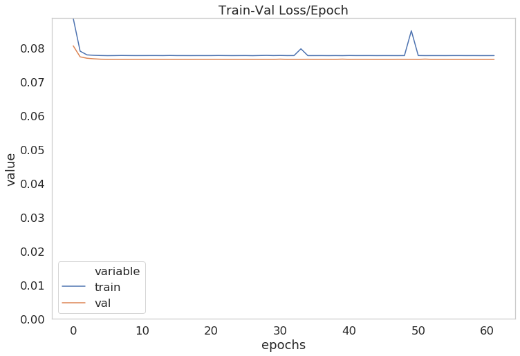
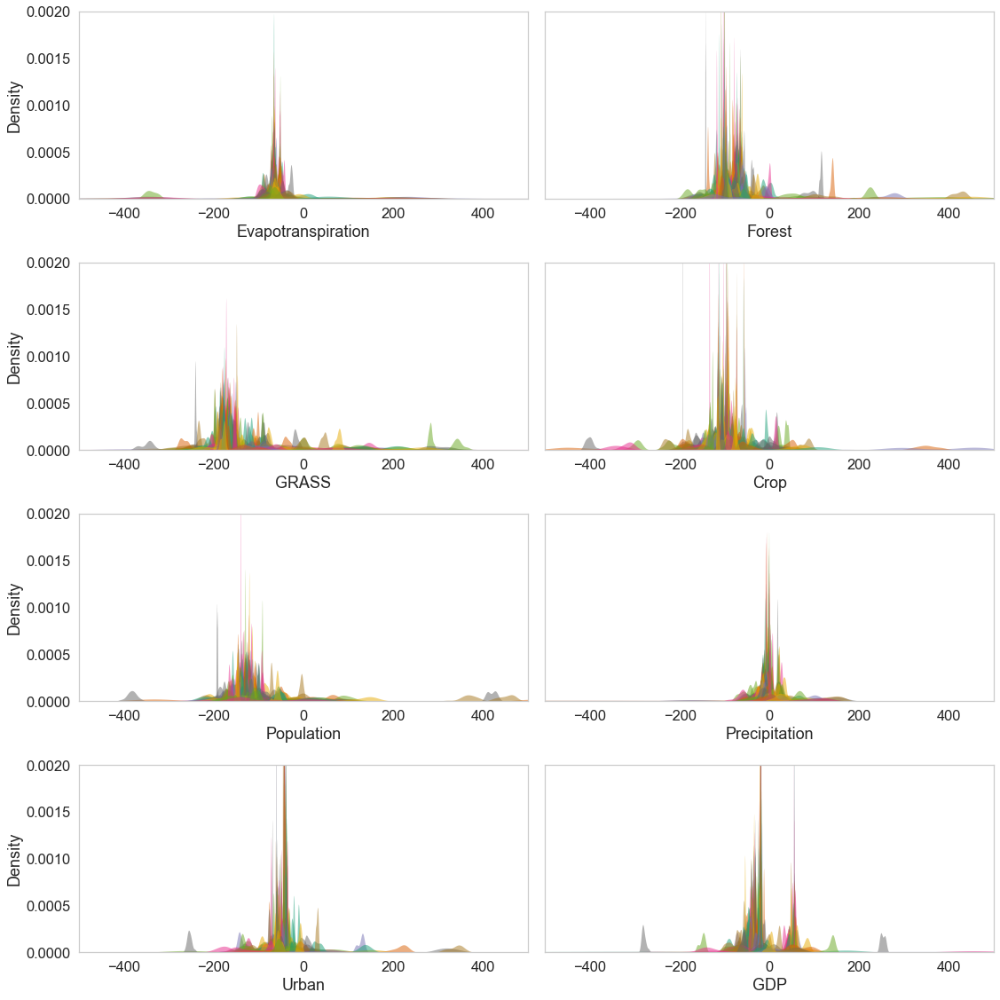
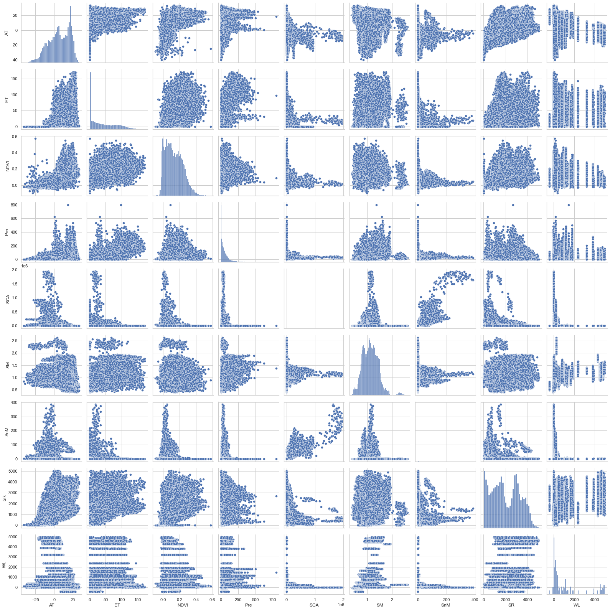

# Global Lake Monitoring

A Python package for predicting **lake surface area** from environmental
features (land cover, climate, hydrology) and explaining the predictions with
**SHAP** values. Built around a 1D Transformer regressor with XGBoost and
Random Forest baselines, applied to a global dataset of ~2,700 lakes.

> Importable as `import lake`. CLI exposed as `lake train …` and
> `lake explain …`.

---

## Sample results

**Measured vs. predicted lake area (XGBoost baseline)** — train R² = 1.00,
held-out test R² = 0.85.


**Transformer training curve** — train/validation MSE per epoch.



**SHAP feature contributions across climate classes** — kernel density of
SHAP values per feature, coloured by Köppen-Geiger climate group. Shows that
the model relies on different drivers for different climate regimes.



**Feature pair-plot from the EDA notebook** — joint and marginal
distributions across the 9 environmental drivers used during exploration.



---

## Install

```bash
cd lake
pip install -e .          # editable install
pip install -e ".[dev]"   # includes pytest + jupyter
```

After install you get a `lake` console script.

---

## Project layout

```
lake/
├── pyproject.toml          # build config + dependencies + CLI entry point
├── configs/
│   └── transformer.yaml    # example training config
├── src/lake/
│   ├── config.py           # LakeConfig dataclass, paths, hyperparameters
│   ├── data/
│   │   └── dataset.py      # per-lake temporal split, scaler, PyTorch dataset
│   ├── models/
│   │   ├── transformer.py  # Transformer1d
│   │   └── tree.py         # RF / GB / XGB factory + training helper
│   ├── training/
│   │   ├── train.py        # train_transformer(), EarlyStopping
│   │   └── evaluate.py     # predict_with_model(), regression_metrics()
│   ├── explain/
│   │   ├── shap_utils.py   # averaged TreeExplainer SHAP
│   │   ├── lakewise.py     # per-lake Ridge/RF/SHAP/permutation
│   │   └── climatewise.py  # per-climate analysis (fixes bug in original)
│   ├── viz/
│   │   ├── loss_curves.py  # train/val loss PNG
│   │   ├── scatter.py      # measured-vs-predicted scatter plots
│   │   └── shap_plots.py   # SHAP summary / bar plots
│   └── cli.py              # `lake train`, `lake explain ...`
├── notebooks/
│   └── demo.ipynb          # thin demo that imports the package
└── outputs/                # everything generated lands here
    ├── figures/            # *** all PNGs *** (loss curves, scatter, SHAP)
    ├── checkpoints/        # best_*.pth files
    ├── predictions/        # train/valid/test prediction CSVs
    └── shap/               # SHAP values + per-lake / per-climate tables
```

---

## Usage

### CLI

```bash
# Train with defaults.
lake train

# Train with a YAML config and override the epoch count.
lake train --config configs/transformer.yaml --epochs 50

# Run per-lake Ridge/RF/SHAP analysis.
lake explain lakewise

# Run per-climate-class analysis.
lake explain climatewise

# Global tree-based SHAP analysis (XGBoost by default).
lake explain tree --kind XGB
```

### Library

```python
from lake import default_config, train_transformer

cfg = default_config(exp_name="my_run")
cfg.training.epochs = 50
cfg.training.debug_row_limit = 1000   # fast iteration
ckpt_path = train_transformer(cfg)
```

### Notebook

See [`notebooks/demo.ipynb`](notebooks/demo.ipynb) — it imports the package
and reproduces the original SHAP plots in <10 lines of code.

---

## Where do figures go?

**All** generated PNGs land under `outputs/figures/`:

| File                              | Produced by                       |
| --------------------------------- | --------------------------------- |
| `loss_<exp_name>.png`             | `lake.viz.save_loss_curve`        |
| `scatter_<exp_name>.png`          | `lake.viz.save_pred_vs_true_scatter` |
| `shap_summary_<exp_name>.png`     | `lake.viz.save_shap_summary_plot` |

No function in the package calls `plt.show()` — they all write to disk
explicitly, so the package works fine in headless / CI environments.

---

## Design notes

* **Importable package** — `from lake.training import train_transformer`.
* **Single `LakeConfig`** dataclass for all paths and hyperparameters,
  loadable from YAML.
* **Central `outputs/figures/`** — every figure produced by the package ends
  up in one folder, never via `plt.show()`, so it runs headlessly too.
* **CLI** with subcommands: `lake train`, `lake explain lakewise`,
  `lake explain climatewise`, `lake explain tree`.
* **Smoke tests** under `tests/` run on synthetic data and don't need the real
  CSV to pass.

---

## License

Not yet specified. Add a `LICENSE` file (e.g. MIT) before publishing.
